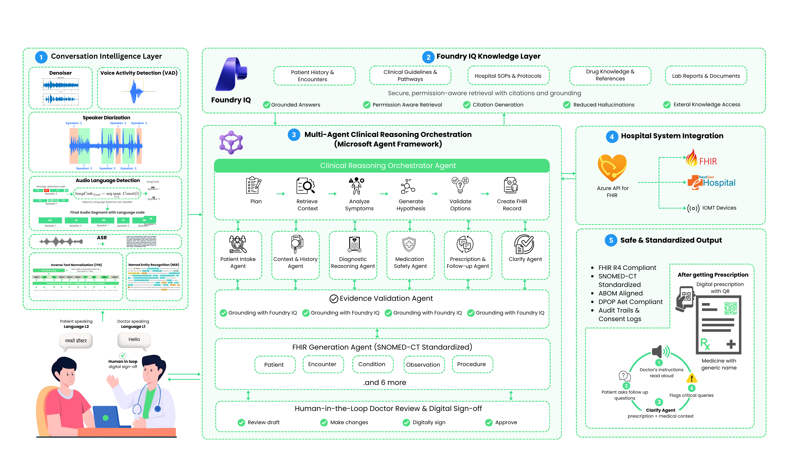

# 🩺 Docvoxia

### Real-Time Multilingual Clinical Reasoning Agent powered by Microsoft Foundry IQ

> Transforming doctor-patient conversations into safe, explainable, and interoperable healthcare records through multi-agent clinical reasoning.

---

## 🚀 Live Demo

🌐 **Try Docvoxia Now**

https://try-docvoxia.justprompt.in/

**No signup required.**

Experience multilingual clinical conversations, AI-powered diagnostic reasoning, medication safety validation, evidence-backed recommendations, and FHIR-compliant healthcare documentation directly in your browser.

---

## 🎯 Problem Statement

Healthcare professionals spend a significant portion of their time documenting consultations and generating prescriptions.

Challenges include:

* Manual documentation workflows
* Medication errors
* Multilingual communication barriers
* Inconsistent clinical records
* Limited interoperability across healthcare systems
* Lack of explainable AI decision support

Medication errors remain one of the most common causes of preventable patient safety incidents.

Traditional speech-to-text systems only transcribe conversations.

They do not understand clinical context, validate decisions, or generate interoperable healthcare records.

---

## 💡 Our Solution

Docvoxia is a **Real-Time Multilingual Clinical Reasoning Agent** that goes beyond transcription.

Using a multi-agent architecture powered by **Microsoft Foundry**, **Foundry IQ**, and advanced clinical reasoning workflows, Docvoxia:

✅ Understands multilingual doctor-patient conversations

✅ Retrieves relevant medical knowledge using Foundry IQ

✅ Performs multi-step clinical reasoning

✅ Detects medication risks and interactions

✅ Generates explainable recommendations

✅ Produces FHIR-compliant healthcare records

✅ Maintains doctor oversight through Human-in-the-Loop approval

---

# 🧠 Why Docvoxia?

Most healthcare AI systems focus on:

```text
Conversation
↓
Transcription
↓
Output
```

Docvoxia performs:

```text
Conversation
↓
Knowledge Retrieval
↓
Clinical Reasoning
↓
Medication Safety Validation
↓
Evidence Validation
↓
FHIR Generation
↓
Doctor Approval
```

This transforms AI from a transcription assistant into a Clinical Decision Intelligence System.

---

# 🏗️ System Architecture

The complete architecture is shown below:



The architecture consists of four major layers:

### 1. Conversation Intelligence Layer

Processes multilingual consultations using:

* Speech Recognition
* Speaker Diarization
* Language Detection
* Medical Entity Extraction
* Clinical Context Understanding

---

### 2. Foundry IQ Knowledge Layer

Provides grounded retrieval using:

* Patient History
* Previous Encounters
* Clinical Guidelines
* Hospital Protocols
* Drug References
* Laboratory Reports

This layer helps reduce hallucinations and enables evidence-backed recommendations.

---

### 3. Multi-Agent Clinical Reasoning Layer

A Clinical Reasoning Orchestrator coordinates multiple specialized agents:

| Agent                      | Responsibility                 |
| -------------------------- | ------------------------------ |
| Patient Intake Agent       | Extract patient information    |
| Context Retrieval Agent    | Retrieve medical context       |
| Diagnostic Reasoning Agent | Generate diagnostic hypotheses |
| Medication Safety Agent    | Detect risks and interactions  |
| Prescription Agent         | Generate prescriptions         |
| Follow-Up Agent            | Generate care instructions     |
| Evidence Validation Agent  | Validate recommendations       |

---

### 4. Healthcare Interoperability Layer

Generates:

* FHIR R4 Resources
* SNOMED CT Standardization
* Structured Clinical Records

All outputs remain under physician control through Human-in-the-Loop approval workflows.

---

# 🔄 End-to-End Workflow

```text
Doctor + Patient Conversation
            ↓
Conversation Intelligence Layer
            ↓
Foundry IQ Retrieval
            ↓
Clinical Reasoning Orchestrator
            ↓
Diagnostic Reasoning Agent
            ↓
Medication Safety Validation
            ↓
Evidence Validation
            ↓
FHIR Record Generation
            ↓
Doctor Review & Approval
            ↓
Hospital Information System
```

---

# 🤖 Multi-Agent Reasoning Workflow

Docvoxia implements a Planner → Executor → Verifier architecture.

### Step 1: Patient Intake Agent

Extracts:

* Symptoms
* Medical History
* Current Medications
* Allergies
* Demographics

---

### Step 2: Context Retrieval Agent

Queries Foundry IQ for:

* Previous Encounters
* Clinical Guidelines
* Hospital SOPs
* Drug References

---

### Step 3: Diagnostic Reasoning Agent

Performs:

* Symptom Analysis
* Differential Diagnosis
* Confidence Scoring
* Clinical Hypothesis Generation

---

### Step 4: Medication Safety Agent

Validates:

* Drug Interactions
* Contraindications
* Allergy Risks
* Dosage Issues

---

### Step 5: Evidence Validation Agent

Verifies all recommendations against:

* Retrieved Knowledge
* Clinical Guidelines
* Drug References

Every recommendation is grounded and explainable.

---

# 🏥 Example Workflow

### Patient

> "I have fever, sore throat, and body pain for the last three days. I am diabetic and currently taking Metformin."

### Foundry IQ Retrieves

* Previous diabetic history
* Clinical fever guidelines
* Drug reference information

### Diagnostic Reasoning Agent

Possible Diagnosis:

* Viral Fever
* Upper Respiratory Infection

Confidence: 91%

### Medication Safety Agent

Checks:

* Existing diabetes medication
* Drug interactions
* Contraindications

### Evidence Validation Agent

Confirms recommendations against retrieved medical knowledge.

### Output

* FHIR Record
* Structured Prescription
* Follow-Up Instructions
* Safety Report

---

# 🛡️ Responsible AI & Safety

Healthcare requires strong safeguards.

Docvoxia includes:

* Human-in-the-Loop Approval
* Medication Safety Validation
* Explainable Recommendations
* Audit Trails
* Evidence Grounding
* Consent Tracking
* Structured Clinical Reasoning

AI recommendations are advisory and never replace clinical judgment.

---

# 🧬 FHIR & Healthcare Standards

Docvoxia generates standardized healthcare outputs using:

### FHIR R4 Resources

* Patient
* Encounter
* Observation
* Condition
* MedicationRequest
* CarePlan

### Terminology Standards

* SNOMED CT

This ensures interoperability across healthcare systems.

---

# ⚙️ Technology Stack

## AI & Agents

* Microsoft Foundry
* Foundry IQ
* Azure OpenAI GPT-4o
* LangGraph
* Multi-Agent Architecture

## Backend

* Python
* FastAPI
* Pydantic
* SQLAlchemy

## Data

* PostgreSQL
* Redis
* Azure AI Search

## Infrastructure

* Docker
* Azure Container Apps
* OpenTelemetry

---

# 📂 Project Structure

```text
docvoxia/

├── app/
│   ├── api/
│   ├── agents/
│   │   ├── patient_intake/
│   │   ├── context_retrieval/
│   │   ├── diagnostic_reasoning/
│   │   ├── medication_safety/
│   │   ├── prescription/
│   │   ├── follow_up/
│   │   └── evidence_validation/
│   │
│   ├── orchestrator/
│   ├── knowledge/
│   ├── fhir/
│   ├── safety/
│   ├── database/
│   ├── services/
│   ├── schemas/
│   └── models/
│
├── tests/
│
├── docs/
│
├── docker/
│
├── scripts/
│
├── deployments/
│
├── specs/
│
├── docvoxia_system_architecture.png
│
└── README.md
```

---

# 📊 Hackathon Alignment

This project was built for:

### Microsoft Agents League

**Reasoning Agents Track**

The solution demonstrates:

* Multi-Agent Collaboration
* Multi-Step Reasoning
* Foundry IQ Grounding
* Clinical Decision Intelligence
* Human Oversight
* Explainable AI
* Enterprise-Ready Healthcare Integration

---

# 🔮 Future Roadmap

* Real-time streaming consultations
* Work IQ integration
* Fabric IQ integration
* Clinical Evaluation Benchmarks
* Healthcare MCP Tools
* Hosted Agents in Microsoft Foundry
* Advanced Hospital Workflow Automation

---

# 🙌 Acknowledgements

Built using:

* Microsoft Foundry
* Foundry IQ
* Azure OpenAI
* LangGraph
* FHIR R4
* SNOMED CT

---

## ⭐ Try It Now

https://try-docvoxia.justprompt.in/

Transforming healthcare conversations into trusted clinical intelligence.
